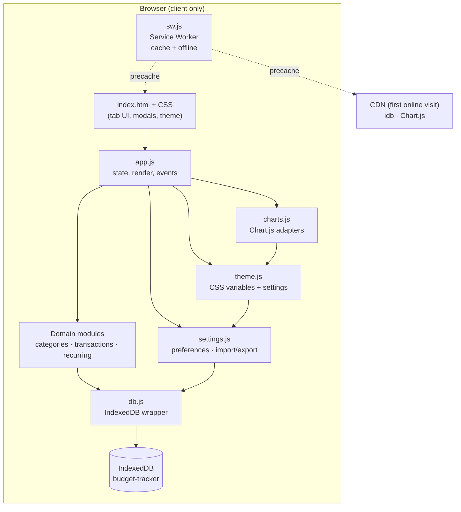

# Budget Tracker

A **personal monthly budget tracker** you install on your phone or computer like an app. It works without an account, without a server, and without an internet connection after the first load. Your data never leaves your device unless you choose to export it.

Built as a **Progressive Web App (PWA)** with vanilla HTML, CSS, and JavaScript — no build step, no framework, no backend.

---

## At a glance

| | |
|---|---|
| **For** | Individuals tracking income, spending, and budgets month by month |
| **Runs on** | Modern browsers (Chrome, Safari, Edge, Firefox) on desktop and mobile |
| **Storage** | IndexedDB in your browser — private to you |
| **Cost** | Free, open source (MIT) |
| **Install** | Add to Home Screen / Install app (requires HTTPS or localhost) |

---

## What you can do

### Everyday use

- **Log transactions** — Record income and expenses with a date, amount, category, and optional description.
- **Browse by month** — Move between months to review past spending or plan ahead.
- **Dashboard** — See income, expenses, and net balance for the selected month; view spending by category (doughnut chart), income vs. expenses (bar chart), and progress toward monthly budget caps.
- **Categories** — Create your own categories with colors and optional monthly spending limits. Default categories are provided on first launch.
- **Scheduled transactions** — Enter a future-dated transaction; it stays marked “Scheduled” until its date arrives, then is confirmed automatically the next time you open the app.
- **Recurring rules** — Set up weekly, biweekly, monthly, or yearly rules (rent, salary, subscriptions). The app generates any missed occurrences when you open it. Rules can be paused without deleting them.
- **Backup & restore** — Export everything as a JSON file; import it on another device or after clearing data.
- **Customize appearance** — Accent color, dark surface themes (Obsidian / Slate / Graphite), income/expense/scheduled colors, and optional chart palette for the category pie chart.

### What it does *not* do

- No bank linking, receipt scanning, or multi-user sync.
- No cloud backup unless you export JSON yourself.
- Deleting a recurring **rule** does not remove transactions already generated from it (by design — historical records stay intact).

---

## How it works (non-technical)

1. You open the app in a browser (or from your home screen after installing).
2. Everything you enter is saved on **your device** in a local database (IndexedDB).
3. A small background script (service worker) caches the app files so pages load offline.
4. Each time the app starts, it catches up: confirms due scheduled transactions and generates any missing recurring entries.
5. Charts and totals always reflect the **month you have selected** at the top of the screen.

Your privacy model is simple: **no server means no data transmission**. Export is the only way data leaves the device, and only when you initiate it.

---

## System architecture

High-level view of how the pieces fit together:



### Architectural principles

| Decision | Rationale |
|----------|-----------|
| **No backend** | Zero hosting cost for users, zero ops, zero account management. Appropriate for single-user, device-local budgeting. |
| **No build step** | Deploy by copying files. Easy to audit, fork, and host on GitHub Pages / Netlify / Cloudflare Pages without CI complexity. |
| **Vanilla JS modules via IIFE** | Each file attaches to `window.BT` namespace (`db`, `ui`, `categories`, …). Explicit script order in `index.html` replaces a bundler. Tradeoff: no tree-shaking; gain: no toolchain for a small, stable codebase. |
| **IndexedDB + `idb`** | Structured, async, large enough for years of transactions. Jake Archibald’s `idb` wrapper keeps upgrade/migration code readable versus raw IDB APIs. |
| **ISO date strings (`YYYY-MM-DD`)** | Transactions store dates without time zones on the wire. Comparisons and month filtering stay deterministic in local time. |
| **Startup catch-up** | Recurring generation and scheduled confirmation run on every launch (not a background cron). Correct for a PWA that may be closed for days; idempotent logic prevents duplicates via `lastGeneratedDate` on rules. |
| **PWA + service worker** | Installable, offline-capable shell. Navigation is network-first (fresh deploys); assets are cache-first. CDN libraries are precached on install when online. |
| **CSS custom properties for theming** | Runtime theme changes without rebuilding CSS. Accent and semantic colors persist in settings; `localStorage` mirrors key values to avoid flash on first paint. |

---

## Data model

Four IndexedDB object stores (schema version **1**, database name `budget-tracker`):

### `transactions`

| Field | Type | Notes |
|-------|------|--------|
| `id` | string (UUID) | Primary key |
| `date` | `YYYY-MM-DD` | Indexed |
| `amount` | number | Positive; type determines sign in UI |
| `type` | `"income"` \| `"expense"` | |
| `categoryId` | string | Indexed |
| `description` | string | Optional |
| `isScheduled` | boolean | Indexed; `true` when date is in the future |
| `confirmedAt` | ISO timestamp \| null | Set when scheduled item becomes real |
| `recurringRuleId` | string \| null | Indexed; links to generating rule |
| `createdAt` | ISO timestamp | |

### `recurringRules`

| Field | Type | Notes |
|-------|------|--------|
| `id` | string (UUID) | Primary key |
| `name` | string | Becomes transaction description |
| `amount`, `type`, `categoryId` | | Same semantics as transactions |
| `frequency` | weekly / biweekly / monthly / yearly | |
| `startDate`, `endDate` | `YYYY-MM-DD` | `endDate` optional |
| `dayOfMonth`, `dayOfWeek` | number | Anchors for monthly/yearly and weekly math |
| `lastGeneratedDate` | `YYYY-MM-DD` \| null | Cursor for catch-up generation |
| `isPaused` | boolean | Indexed; skips generation when true |
| `createdAt` | ISO timestamp | |

### `categories`

| Field | Type | Notes |
|-------|------|--------|
| `id` | string (UUID) | Primary key |
| `name`, `type`, `color` | | `type` is income or expense |
| `budgetCap` | number \| null | Monthly cap for expense categories only |

### `settings`

Single document keyed by `key: "app"`: currency symbol, first day of week, theme (`accentColor`, `surfaceTheme`, `colorIncome`, `colorExpense`, `colorScheduled`, `pieUseThemePalette`, `chartPalette[]`).

### Backup format

Export produces JSON:

```json
{
  "app": "budget-tracker",
  "version": 1,
  "exportedAt": "<ISO8601>",
  "data": {
    "transactions": [],
    "recurringRules": [],
    "categories": [],
    "settings": []
  }
}
```

Import validates structure, clears all stores, and bulk-writes the backup (full replace).

---

## Application lifecycle

**On each launch** (`app.js` → `start()`):

1. Open IndexedDB; load settings; apply theme (from DB + `localStorage` cache).
2. Ensure default categories exist; load category cache.
3. `recurring.generateMissing()` — create transactions for all rule occurrences from `lastGeneratedDate` through today.
4. `transactions.autoConfirmDueScheduled()` — flip `isScheduled` off for past-due items.
5. Bind UI; render active tab; register service worker (skipped on `file://`).

**Rendering model**: Imperative DOM updates — `renderDashboard`, `renderTransactionsTab`, etc. read from IndexedDB (or in-memory caches where modules keep them) and build HTML via `ui.el` / template strings. No virtual DOM. Month navigation in `state` triggers `renderAll()`.

**UI shell**: Five tabs (Dashboard, Transactions, Recurring, Categories, Settings). Mobile: floating bottom nav; desktop (≥768px): fixed sidebar. Transactions tab uses a FAB for add.

---

## Module responsibilities

| File | Responsibility |
|------|----------------|
| `js/db.js` | IDB open/upgrade, CRUD, `bulkPut`, `clearAll`, UUID helper |
| `js/ui.js` | DOM utilities, modals, confirm dialog, toasts, tab transitions, money/date formatting, number animation |
| `js/categories.js` | Category CRUD, defaults, reassignment on delete, dependent counts |
| `js/transactions.js` | Transaction CRUD, month queries, totals, spend-by-category, scheduling, auto-confirm |
| `js/recurring.js` | Rule CRUD, occurrence date math, `generateMissing`, `nextDueAfter` |
| `js/charts.js` | Chart.js defaults (dark theme), doughnut + horizontal bar, theme-aware colors |
| `js/settings.js` | Settings load/save, export/import/clear |
| `js/theme.js` | Accent/surface/semantic colors; palette; persists to settings; `bt-theme-change` event |
| `js/app.js` | Entry point, global state, all renderers and form modals, event wiring |
| `sw.js` | Precache list, install/activate, network-first HTML / cache-first assets |
| `css/styles.css` | Design tokens (`:root`), layout, components, responsive breakpoints |

Scripts load in dependency order; each module is an IIFE exporting to `window.BT`.

---

## Recurring & scheduling (behavioral detail)

**Scheduled transactions**

- Created with `isScheduled: true` when `date > today`.
- Excluded from income/expense totals and pie chart spend until confirmed.
- Shown in “Upcoming This Month” on the dashboard.
- On startup, any scheduled item with `date <= today` is confirmed in place (same record, not duplicated).

**Recurring rules**

- `generateMissing()` iterates all non-paused rules and computes occurrences from the day after `lastGeneratedDate` (or from `startDate` if never generated) through today, capped by optional `endDate`.
- Each generated row is a normal transaction with `recurringRuleId` set and `isScheduled: false`.
- Monthly rules clamp day-of-month to the last day of shorter months (e.g. Jan 31 → Feb 28/29).
- Safety cap of 10,000 iterations per rule prevents runaway loops on bad data.
- Deleting a rule removes only the rule; existing generated transactions remain unless deleted manually.

---

## Tech stack

| Layer | Technology | Why |
|-------|------------|-----|
| Markup / style | HTML5, CSS3 (custom properties) | Full control; dark fintech UI with Syne, DM Sans, DM Mono |
| Logic | ES6+ JavaScript (modules as IIFEs) | No transpile step; runs directly in evergreen browsers |
| Persistence | IndexedDB via [`idb`](https://github.com/jakearchibald/idb) v7 (UMD CDN) | Async API, small dependency |
| Charts | [Chart.js](https://www.chartjs.org/) 4.4 (UMD CDN) | Doughnut + bar charts with theme integration |
| Offline | Service Worker API, Web App Manifest | Installable PWA, asset caching |
| Icons | `icon.png` → `icons/icon-192.png`, `icons/icon-512.png` | Standard PWA icon sizes |

External scripts are precached when the service worker installs online so the app remains usable offline afterward.

---

## Project structure

```
/
├── index.html          # Shell, tabs, modals, script tags
├── manifest.json       # PWA manifest
├── sw.js               # Service worker
├── icon.png            # Source app icon
├── README.md
├── css/
│   └── styles.css      # Design system + layout
├── js/
│   ├── db.js
│   ├── ui.js
│   ├── categories.js
│   ├── transactions.js
│   ├── recurring.js
│   ├── charts.js
│   ├── settings.js
│   ├── theme.js
│   └── app.js
└── icons/
    ├── icon-192.png
    └── icon-512.png
```

---

## Running locally

Service workers require `http://` or `https://` (not `file://`).

```bash
cd Budget-Tracker
python3 -m http.server 8080
# open http://localhost:8080
```

Alternatives: `npx serve -p 8080 .`, VS Code Live Server, or any static file server.

On `file://`, the app still runs but the service worker, offline mode, and install prompt are disabled.

---

## Deploying

The repository is a **static site** — no build command.

| Host | Steps |
|------|--------|
| **GitHub Pages** | Push to GitHub → Settings → Pages → deploy from `main` / root |
| **Cloudflare Pages** | Connect repo; build command: none; output: `/` |
| **Netlify** | Drag-and-drop folder or connect repo; no build |

Deploy over **HTTPS** so users can install the PWA and use the service worker.

Regenerate PWA icons after changing `icon.png`:

```bash
sips -z 192 192 icon.png --out icons/icon-192.png
sips -z 512 512 icon.png --out icons/icon-512.png
```

Bump `CACHE_VERSION` in `sw.js` when shipping asset changes so clients refresh cached files.

---

## Installing on a device

| Platform | How |
|----------|-----|
| **Android** (Chrome / Edge) | Open deployed URL → menu → Install app / Add to Home Screen |
| **iOS** (Safari) | Open URL → Share → Add to Home Screen |
| **Desktop** (Chrome / Edge) | Install icon in the address bar when offered |

After install, the app opens in standalone mode (no browser chrome) with the configured theme color.

---

## Data & privacy

- All records live in **IndexedDB** inside the browser profile for that origin.
- Clearing site data, uninstalling the PWA, or wiping browser storage **deletes everything** unless you have an export.
- **Export** (Settings) downloads a JSON backup. **Import** replaces all local data with the file contents.
- **Clear all data** wipes every store and reseeds default categories and default settings.

There is no analytics, authentication, or third-party API in the application layer.

---

## For reviewers & recruiters

This project demonstrates:

- **Offline-first PWA design** — manifest, service worker strategies, installability, cache versioning.
- **Client-side persistence** — IndexedDB schema design, indexes for query paths, bulk import/export.
- **Domain modeling without a framework** — recurring occurrence engine, scheduled-state machine, month-scoped aggregates.
- **Pragmatic UX engineering** — confirm flows, toasts, responsive nav, runtime theming via CSS variables, accessible tab roles.
- **Conscious tradeoffs** — no React/Vue (simplicity vs scale); no backend (privacy vs sync); catch-up on launch vs server cron.

Suitable as a portfolio piece for roles involving frontend architecture, PWAs, or product-minded full-stack work where “no backend” is an explicit product choice rather than a shortcut.

---

## License

MIT — use, modify, and distribute freely. No warranty.
